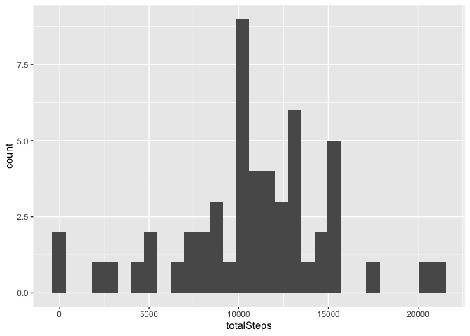
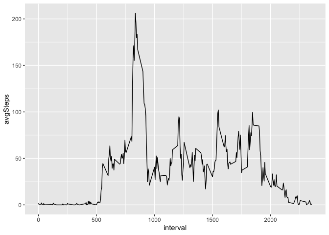
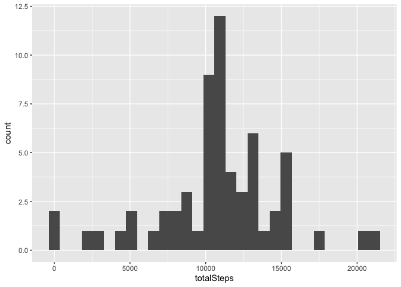
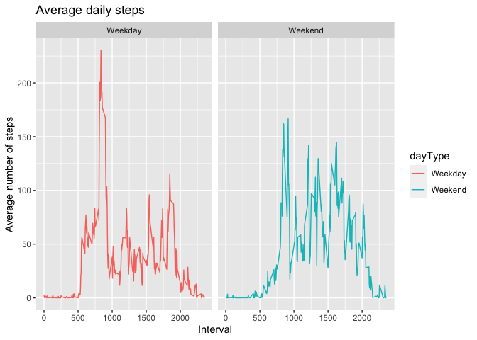

##Load library

```r
library(tidyverse)
```

```
## ── Attaching packages ─────────────────────────────────────── tidyverse 1.3.1 ──
```

```
## ✓ ggplot2 3.3.5     ✓ purrr   0.3.4
## ✓ tibble  3.1.6     ✓ dplyr   1.0.8
## ✓ tidyr   1.2.0     ✓ stringr 1.4.0
## ✓ readr   2.1.2     ✓ forcats 0.5.1
```

```
## Warning: package 'tidyr' was built under R version 4.1.2
```

```
## Warning: package 'readr' was built under R version 4.1.2
```

```
## Warning: package 'dplyr' was built under R version 4.1.2
```

```
## ── Conflicts ────────────────────────────────────────── tidyverse_conflicts() ──
## x dplyr::filter() masks stats::filter()
## x dplyr::lag()    masks stats::lag()
```


## Loading and preprocessing the data

```r
if(!file.exists("activity.zip")) {
        temp <- tempfile()
        download.file("https://d396qusza40orc.cloudfront.net/repdata%2Fdata%2Factivity.zip",temp)
        unzip(temp)
        unlink(temp)
}

activity <- read.csv("activity.csv") %>% 
  mutate(date=as.POSIXct(date, "%Y-%m-%d"), weekday=weekdays(date)) 
```

```
## Warning in strptime(xx, f, tz = tz): unknown timezone '%Y-%m-%d'
```

```
## Warning in as.POSIXct.POSIXlt(x): unknown timezone '%Y-%m-%d'
```

```
## Warning in strptime(xx, f, tz = tz): unknown timezone '%Y-%m-%d'
```

```
## Warning in as.POSIXct.POSIXlt(x): unknown timezone '%Y-%m-%d'
```

```
## Warning in strptime(xx, f, tz = tz): unknown timezone '%Y-%m-%d'
```

```
## Warning in as.POSIXct.POSIXlt(x): unknown timezone '%Y-%m-%d'
```

```
## Warning in strptime(xx, f, tz = tz): unknown timezone '%Y-%m-%d'
```

```
## Warning in as.POSIXct.POSIXlt(x): unknown timezone '%Y-%m-%d'
```

```
## Warning in strptime(xx, f, tz = tz): unknown timezone '%Y-%m-%d'
```

```
## Warning in as.POSIXct.POSIXlt(x): unknown timezone '%Y-%m-%d'
```

```
## Warning in strptime(x, f, tz = tz): unknown timezone '%Y-%m-%d'
```

```
## Warning in as.POSIXct.POSIXlt(as.POSIXlt(x, tz, ...), tz, ...): unknown timezone
## '%Y-%m-%d'
```

```
## Warning in as.POSIXlt.POSIXct(x, tz): unknown timezone '%Y-%m-%d'
```

```r
head(activity)
```

```
## Warning in as.POSIXlt.POSIXct(x, tz): unknown timezone '%Y-%m-%d'
```

```
##   steps       date interval weekday
## 1    NA 2012-10-01        0  Monday
## 2    NA 2012-10-01        5  Monday
## 3    NA 2012-10-01       10  Monday
## 4    NA 2012-10-01       15  Monday
## 5    NA 2012-10-01       20  Monday
## 6    NA 2012-10-01       25  Monday
```

## Histogram of the total number of steps taken each day

```r
activity_daily_grouped <- activity %>% drop_na() %>% 
  group_by(date) %>%
  summarise(totalSteps = sum(steps))
```


```r
ggplot(activity_daily_grouped, aes(x=totalSteps)) + geom_histogram()
```

```
## `stat_bin()` using `bins = 30`. Pick better value with `binwidth`.
```

<!-- -->

## What is mean/median total number of steps taken per day?

```r
mean(activity_daily_grouped$totalSteps)
```

```
## [1] 10766.19
```

```r
median(activity_daily_grouped$totalSteps)
```

```
## [1] 10765
```

## Time series plot of the average number of steps taken


```r
avg_daily_activity <- activity %>% drop_na() %>% 
  group_by(interval) %>% 
  summarise(avgSteps=mean(steps))
```


```r
ggplot(avg_daily_activity, aes(x=interval, y=avgSteps)) + geom_line()
```

<!-- -->


## Imputing missing values

```r
sum(is.na(activity$steps))
```

```
## [1] 2304
```

```r
# Replace the NAs with mean
imputed_activity <- activity %>% 
  group_by(interval) %>% 
  mutate(steps = ifelse(is.na(steps), mean(steps, na.rm=TRUE), steps))
```

```r
imputed_daily_total <- imputed_activity %>% 
  group_by(date) %>%
  summarise(totalSteps = sum(steps))

ggplot(imputed_daily_total , aes(x=totalSteps)) + geom_histogram()
```

```
## `stat_bin()` using `bins = 30`. Pick better value with `binwidth`.
```

<!-- -->

```r
mean(imputed_daily_total$totalSteps)
```

```
## [1] 10766.19
```

```r
median(imputed_daily_total$totalSteps)
```

```
## [1] 10766.19
```


## Are there differences in activity patterns between weekdays and weekends?


```r
activity_dayType <- imputed_activity %>% 
  mutate(dayType= ifelse(weekday=="Saturday" | weekday=="Sunday", "Weekend", "Weekday"))

avg_activity_dayType <- activity_dayType %>% 
  group_by(dayType, interval) %>% 
  summarise(avgSteps=mean(steps))
```

```
## `summarise()` has grouped output by 'dayType'. You can override using the
## `.groups` argument.
```

```r
head(avg_activity_dayType)
```

```
## # A tibble: 6 × 3
## # Groups:   dayType [1]
##   dayType interval avgSteps
##   <chr>      <int>    <dbl>
## 1 Weekday        0   2.25  
## 2 Weekday        5   0.445 
## 3 Weekday       10   0.173 
## 4 Weekday       15   0.198 
## 5 Weekday       20   0.0990
## 6 Weekday       25   1.59
```


```r
ggplot(avg_activity_dayType, aes(x=interval, y=avgSteps, color=dayType)) + 
  geom_line() + 
  facet_grid(~dayType) +
  labs(title = "Average daily steps", x = "Interval", y = "Average number of steps")
```

<!-- -->


